[README (2).md](https://github.com/user-attachments/files/29806642/README.2.md)<!--
  ============================================
  QUICK SETUP CHECKLIST — do this before you publish
  ============================================
  1. Create a PUBLIC repo named exactly YOUR-USERNAME/YOUR-USERNAME
     (same as your GitHub username). GitHub auto-shows its README on
     your profile page.
  2. Upload the three custom SVGs into an "assets" folder in that repo:
       assets/header.svg
       assets/divider.svg
       assets/footer.svg
     (all three were generated alongside this file — just keep the
     same names/folder, or update the paths below if you rename them)
  3. Replace YOUR-USERNAME everywhere below (appears ~15 times) with
     your real GitHub username.
  4. Replace YOUR_LEETCODE_USERNAME with your LeetCode username.
  5. Replace YOUR-LINKEDIN / YOUR-EMAIL / YOUR-PORTFOLIO-LINK near the
     bottom with your real links.
  6. Replace Rescue-Force-4 / AI-Learning-Platform /
     Agricultural-Monitoring-System with the EXACT names of the public
     repos on your GitHub for these projects — the green "pin" cards
     only render once a public repo with that exact name exists.
  7. Optional: add the separate snake.yml file to
     .github/workflows/snake.yml in the same profile repo to switch on
     the live contribution snake near the bottom.
  ============================================
-->

  

  

  
  
  
  

  

## 👋 About Me

- 🎓 **B.E. in Computer Science and Engineering** @ Sri Ramakrishna Engineering College (SREC), Coimbatore
- 📈 Currently holding a **9.46 CGPA**
- 🧠 Deep in **DSA, Competitive Programming, and AI/ML**
- 🌍 Building projects at the intersection of **AI and real-world impact** — healthcare and agriculture so far
- 🔭 Exploring **Quantum Computing** and **Cyber Security** on the side

> *"I'd rather spend an hour debugging on my own than copy a working answer — that's where the real learning happens."*

 

| 📘 Semester 1 | 📗 Semester 2 | 🎯 Current CGPA |
|:---:|:---:|:---:|
| 9.24 | 9.70 | **9.46** |

 

## 🛠️ Tech Stack

  

  
  

  

## 🧮 Data Structures & Algorithms

**Data Structures:** Arrays · Strings · Stacks · Hash Maps · Sets · Matrices

**Algorithms:** Dynamic Programming · Digit DP

**Problem-Solving Focus:** Mathematical reasoning · Optimization · Pattern discovery

🧩 A few favorite problems I've cracked

 

- **LeetCode 233** — Number of Digit One &nbsp;*(Digit DP)*
- **LeetCode 84** — Largest Rectangle in Histogram &nbsp;*(Monotonic Stack)*
- **LeetCode 85** — Maximal Rectangle &nbsp;*(Stack + DP)*
- **LeetCode 60** — Permutation Sequence &nbsp;*(Combinatorics)*
- **LeetCode 564** — Find the Closest Palindrome &nbsp;*(Math / Strings)*

 

## 🚀 Featured Projects

### 🚑 Rescue Force 4 — *Ideathon Winner* 🥇
Solves the real-world problem of ambulance delays caused by traffic congestion.
- Real-time hospital vacancy & bed availability tracking
- Nearby hospital recommendations
- Shortest-route suggestions for ambulances
- Emergency response optimization

### 🧬 AI-Assisted Learning Platform — *GenAI 18-Hour Hackathon*
Makes biotechnology concepts easier to learn through AI-generated, personalized educational content.

### 🌱 Agricultural Monitoring System — *In Progress*
A smart-greenhouse concept combining computer vision (YOLO) with automated monitoring — starting with curry-leaf disease detection and PTZ camera-based crop tracking.

  

## 🏆 Achievements & Hackathons

| Achievement | Details |
|---|---|
| 🥇 **Ideathon Winner** — 1st Place | *Rescue Force 4* (Team Base4) — Smart Ambulance Routing & Hospital Availability System |
| 🧬 **GenAI Hackathon** (18-hour) | Built an AI-assisted Biotechnology Learning Platform |
| 🧩 **Institutional Coding Contest** — 1st Place | topped the offline round |
| 🥇 **HackerRank** — Gold Badge | Python and C programming |

  

## 📊 GitHub Stats

  
  

  

  

  

 

## 🐍 Live Contribution Snake

  <picture>
    <source media="(prefers-color-scheme: dark)" srcset="https://raw.githubusercontent.com/BALAJIx64/BALAJIx64/output/github-contribution-grid-snake-dark.svg" />
    <source media="(prefers-color-scheme: light)" srcset="https://raw.githubusercontent.com/BALAJIx64/BALAJIx64/output/github-contribution-grid-snake.svg" />
    
  </picture>

⚙️ 2-minute setup (blank until you enable it)

 

1. Add the separate `snake.yml` file to `.github/workflows/snake.yml` inside your `YOUR-USERNAME/YOUR-USERNAME` profile repo.
2. Open the **Actions** tab on that repo and enable workflows if prompted.
3. Run the "Generate Snake" workflow once manually (▶ *Run workflow*), or just wait for its schedule.
4. It commits an animated SVG to an `output` branch — the image above comes alive automatically and re-renders itself on schedule.

 

## 🎯 Currently Learning

- [x] Arrays & Strings in C — DSA foundations
- [x] Easy-level LeetCode problem solving
- [ ] HTML → CSS → JavaScript — Web Fundamentals
- [ ] Intermediate DSA — Stacks, Hash Maps, Graphs
- [ ] A full-stack project combining AI + Web

  
  

  

## 📫 Connect With Me

  
  

  

