<!--
  ============================================
  QUICK SETUP CHECKLIST — do this before you publish
  ============================================
  This is a NEW visual direction (dark navy / white / blue cinematic
  style) — it uses a different set of asset files than any earlier
  version. Use these four:
       assets/hero.svg
       assets/cards.svg
       assets/divider2.svg
       assets/pascal2.svg

  1. Create a PUBLIC repo named exactly YOUR-USERNAME/YOUR-USERNAME
     (same as your GitHub username). GitHub auto-shows its README on
     your profile page.
  2. Upload the four SVGs above into an "assets" folder in that repo.
  3. Replace YOUR-USERNAME everywhere below with your real GitHub
     username.
  4. Replace YOUR_LEETCODE_USERNAME, YOUR-LINKEDIN, YOUR-EMAIL,
     YOUR-PORTFOLIO-LINK with your real details.
  5. Replace Rescue-Force-4 / AI-Learning-Platform /
     Agricultural-Monitoring-System with the EXACT names of the public
     repos on your GitHub — the pin cards only render once a public
     repo with that exact name exists.

  Note: I trimmed the GitHub-stats/streak/trophy/snake widgets out of
  the main flow to keep this version genuinely minimal, matching the
  cinematic direction — they're tucked into a collapsible "Extended
  Stats" section near the bottom instead, so nothing is lost, just
  hidden by default. Say the word if you'd rather they stay visible.
  CHECK
  ============================================
-->

  

  

  

## About Me

- 🎓 **B.E. in Computer Science and Engineering** @ Sri Ramakrishna Engineering College (SREC), Coimbatore
- 📈 Currently holding a **9.46 CGPA**
- 🧠 Deep in **DSA, Competitive Programming, and AI/ML**
- 🌍 Building projects at the intersection of **AI and real-world impact** — healthcare and agriculture so far
- 🔭 Exploring **Quantum Computing** and **Cyber Security** on the side

> *"I'd rather spend an hour debugging on my own than copy a working answer — that's where the real learning happens."*

 

| Semester 1 | Semester 2 | Current CGPA |
|:---:|:---:|:---:|
| 9.24 | 9.70 | **9.46** |

  

## Tech Stack

  

  <!-- 
   -->
  

  

## Data Structures & Algorithms

**Data Structures:** Arrays · Strings · Stacks · Sets · Matrices

**Algorithms:** Dynamic Programming · Digit DP

**Problem-Solving Focus:** Mathematical reasoning · Optimization · Pattern discovery

A few favorite problems I've cracked

 

- **LeetCode 233** — Number of Digit One &nbsp;*(Digit DP)*
- **LeetCode 84** — Largest Rectangle in Histogram &nbsp;*(Monotonic Stack)*
- **LeetCode 85** — Maximal Rectangle &nbsp;*(Stack + DP)*
- **LeetCode 60** — Permutation Sequence &nbsp;*(Combinatorics)*
- **LeetCode 564** — Find the Closest Palindrome &nbsp;*(Math / Strings)*

 

<!-- 

  

<i>A little combinatorics fun — Pascal's Triangle building itself, colored by parity.</i>

  

 -->

## Featured Projects

### Rescue Force 4 — Ideathon Winner 🥇
Solves the real-world problem of ambulance delays caused by traffic congestion.
- Real-time hospital vacancy & bed availability tracking
- Nearby hospital recommendations
- Shortest-route suggestions for ambulances
- Emergency response optimization

### AI-Assisted Learning Platform — GenAI 18-Hour Hackathon
Makes biotechnology concepts easier to learn through AI-generated, personalized educational content.

### Agricultural Monitoring System — In Progress
A smart-greenhouse concept combining computer vision (YOLO) with automated monitoring — starting with curry-leaf disease detection and PTZ camera-based crop tracking.

  

## Achievements & Hackathons

| Achievement | Details |
|---|---|
| 🥇 **Ideathon Winner** — 1st Place | *Rescue Force 4* (Team Base4) — Smart Ambulance Routing & Hospital Availability System |
| 🧬 **GenAI Hackathon** (18-hour) | Built an AI-assisted Biotechnology Learning Platform |
| 🥇 **HackerRank** — Gold Badge | Python and C programming |

 

📊 Extended Stats & Live Data (click to expand)

 

  

<!-- 

  
  

 -->

  

<!-- 

  

 -->

  

<!-- 

  <picture>
    <source media="(prefers-color-scheme: dark)" srcset="https://raw.githubusercontent.com/BALAJIx64/BALAJIx64/output/github-contribution-grid-snake-dark.svg" />
    <source media="(prefers-color-scheme: light)" srcset="https://raw.githubusercontent.com/BALAJIx64/BALAJIx64/output/github-contribution-grid-snake.svg" />
    
  </picture>

Snake needs the separate <code>snake.yml</code> workflow added to <code>.github/workflows/</code> to activate.
 -->

  

## Let's Connect

  <a href="https://linkedin.com/in/balaji-c-m">LinkedIn</a> &nbsp;·&nbsp;
  <a href="mailto:balaji.c.m.x64@gmail.com">Email</a> &nbsp;

  

